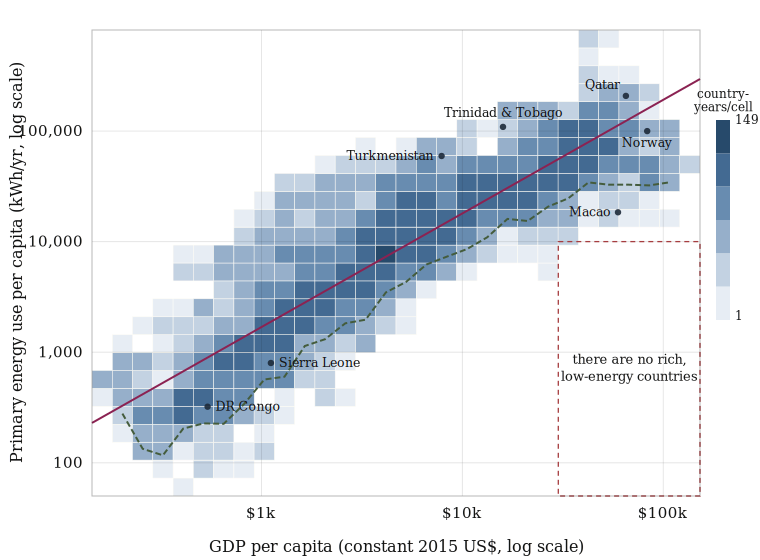

# There are no rich, low-energy countries

Reproducible code and data behind the claim that, across the full 1980–2023
record, **no economy has been rich while consuming little energy**, that the
high-income, low-energy corner of the joint distribution is empty.

The analysis merges every country-year for which both figures are reported into
a single panel of **8,090 observations** across **200 countries**, using
**real** GDP per capita (constant 2015 US$, so the 44-year span isn't distorted
by inflation) and **primary** energy per capita (all energy, not just
electricity).



## Run it

Standard library only 

```bash
python energy_gdp.py
```

This writes:

- `energy-gdp-panel-1980-2023.csv` — the merged panel (one row per country-year)
- `energy-gdp-chart.svg` — the log–log density chart

and prints the headline statistics. 

## Expected output

```
n=8090  beta=1.028  r=0.899  rho=0.912  R2=0.809  rB=0.908  rW=0.677  betaW=0.795
sigma=0.324 dex  (200 countries)
empty corner: 0 of 1172 country-years with GDP >= $30k below 10,000 kWh (lowest: 12,160 kWh, Macao SAR, China 1991)
```

## Results in brief

- **Tight, near-proportional relationship.** In logs, energy use scales almost
  one-for-one with income: elasticity β ≈ 1.03, Pearson r = 0.90 (R² = 0.81),
  residual scatter ≈ 0.32 dex (a typical country within a factor of ~2 of the
  fit).
- **An empty corner.** Of the **1,172** country-years with real GDP per capita
  at or above \$30,000, **not one** runs on less than **10,000 kWh** of primary
  energy per person per year. The lowest is Macao (12,160 kWh, 1991) — a
  services-and-tourism enclave that imports its energy-intensive goods.
- **Holds within countries, not just across them.** Splitting each series into a
  country mean and its deviations: between-country r_B = 0.91; within-country
  r_W = 0.68 with slope β_W = 0.80 (a 1% rise in a country's own real income has
  historically come with ~0.8% more energy).

## Data sources

Both datasets are redistributed here **with attribution** under their open
licences. 

- **Primary energy per capita** — [Our World in Data](https://ourworldindata.org/energy),
  based on the Energy Institute *Statistical Review of World Energy* and the
  U.S. Energy Information Administration. Licensed **CC BY 4.0**.
  File: `data/owid-primary-energy-per-capita.csv`
  (column `primary_energy_consumption_per_capita__kwh`).
- **GDP per capita, constant 2015 US$** — [World Bank](https://data.worldbank.org/indicator/NY.GDP.PCAP.KD),
  indicator `NY.GDP.PCAP.KD`. World Bank open data, **CC BY 4.0**.
  File: `data/worldbank-gdp-per-capita-constant-2015-usd-1980-2024.json`.

World Bank regional/income **aggregates** are excluded so only sovereign
entities remain (see `AGG` in `energy_gdp.py`).

## License

MIT. Data: as noted above, © the respective providers.
